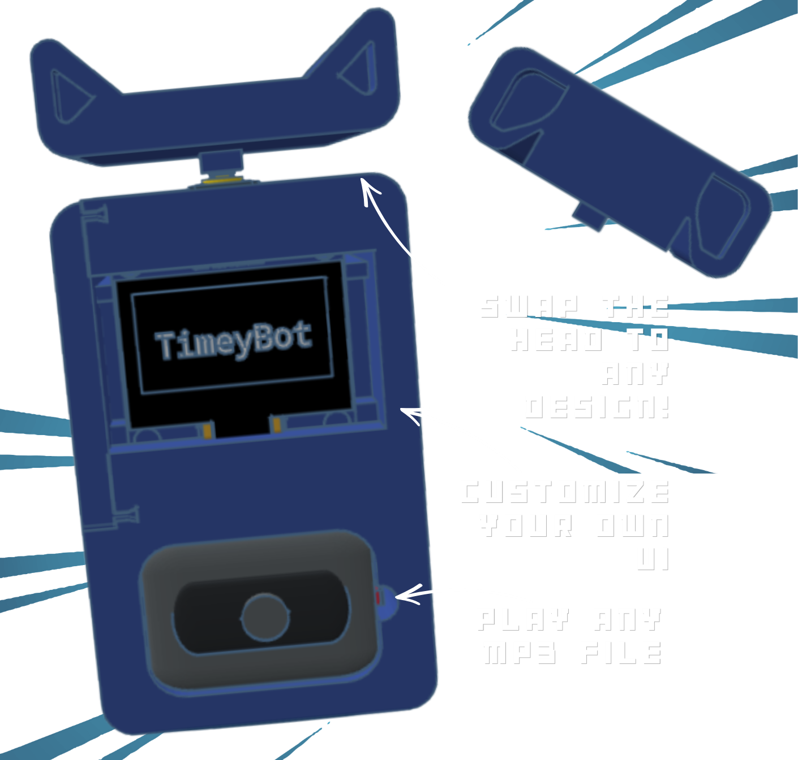

# TimeyBot

## A cute Time tracker, Base functions include:
Stopwatch,
Timer,
Local Time,
Calendar reminder,
Alarm,
Music Player,
Pomodoro Tracker.
## Why Timey

It began when I was studying for exams; I always needed a study tool that was a time tracker and doubled as an audio player.  
Sure, there were phone apps to do so, but i kept finding myself scrolling whenever I go check on it.  
You could say I had been planing to make Timey for a long time  
It features all-in-one functions and can be built on to add your own Songs, Functions, Design and more.  
I made it specifically so that it doubles as a study partner, with time tracking and task reminder features and no distractions from other apps.    
## BOM

| Component | Description | Unit Price | Qty | Total |
|------------|------------|------------|-----|--------|
| ESP32 Dev Board (Micro USB) | Microcontroller | $6.03 | 1 | $6.03 |
| 128x64 1.3" OLED Display (I2C) | UI Display | $5.49 | 1 | $5.49 |
| 4Ω Speaker | Playing Music and Alarms | $3.63 | 1 | $3.63 |
| MAX98357 Amplifier | Amplify Sound | $3.27 | 1 | $3.27 |
| Jumper Wires (Female-Female) | Connect the Circuit | $1.48 | 1 | $1.48 |
| USB to Micro USB Cable | Power the Circuit | $1.57 | 1 | $1.57 |
| Push Button | Control the UI | $0.66 | 1 | $0.66 |
| Screw (10 pcs) | Locking in the PCB and components | $1.20 | 1 | $1.20 |
| Pin Header Female | Solder into PCB | $0.50 | 1 | $0.50 |
| DS3231 RTC module | Track local time offline | $2.21 | 1 | $2.21 |
| Pin Header Male (1x40) |Connecting components with PCB | $0.12 | 1 | $0.12 |
| 0805 SMD Ceramic Capacitor | Prevent brownout/ ESP crashes | $1.22 | 1 | $1.22 |
| Terminal Block 2p | To connect USB cable to esp | $0.12 | 1 | $0.12 |
| Hex Nut (M3) | To lock in button PCB and slider | $0.12 | 1 | $0.32 |

### Optional Storage Upgrade (For MP3 files)

| Component | Description | Price |
|------------|------------|--------|
| Micro SD Card | Store MP3 Files | $1.13 |
| Micro SD Card Reader | Connect to ESP32 | $0.50 |

### Estimated Total Cost

**$29.33 USD**   
STL files include: (TimeyBotMainCase), (TimeyBotSlider), (TimeyBotBackplate), (Extensions file>> (TimeyBot_eDog), (TimeyBot_eCat) )
## How to Use?
The starting page will be the Local Time Mode. Click the button on top (HEAD) to scroll down the menu and select different modes:
- Music Player Mode - Listening  
- Time Track Mode - Timer, Stopwatch, Alarm, Calendar Reminder  
- Study Mode - Pomodoro & Music  
## Setting up
1. Print the STL files.  
2. Upload the IDE code into the ESP32, remember to install ESP Boards and Adafruit Libraries.  
3. Wire the components into the case as shown in the Wiring Diagram.   

